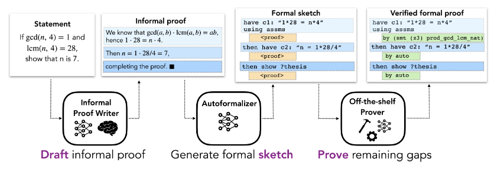

# 📝 [Draft, Sketch, and Prove: Guiding Formal Theorem Provers with Informal Proofs] Review

> **Paper**: [[Link](https://arxiv.org/abs/2210.12283)]
> 
> **Author**: Albert Q. Jiang, Sean Welleck, Jin Peng Zhou, Wenda Li, Jiacheng Liu, Mateja Jamnik, Timothee Lacroix, Yuhuai Wu, Guillaume Lample
> 
> **Tags**: #DSP #Informal_Proofs #Formal_Proofs #Automated_Provers #Autoformalization #In-line_Comments
>
> **Reviewer**: Woojin Cho (WoojinCho-Ryan)
> 
> **Status**: ✅ Read 

## 1. ⚡ One-Line Summary
This paper introduces the DSP (Draft, Sketch, and Prove) methodology, which translates informal proofs into formal proof sketches to guide automated theorem provers (such as Isabelle/HOL), significantly improving performance on the miniF2F benchmark.

## 2. ❓ Problem Definition
Existing Automated Theorem Proving (ATP) research has struggled due to a scarcity of formal mathematical data and vast search spaces. Conversely, LLMs excel at informal mathematics (natural language proofs) but lack logical rigor, often resulting in hallucinations. The authors aim to bridge this gap by creating a framework that leverages abundant informal data to produce rigorous formal proofs.

## 3. 💡 Key Methodology
- **Draft:** First, an LLM (e.g., Minerva) generates an informal proof (natural language proof) for a given problem. (Human proofs are also used for comparison.)
- **Sketch:** The generated informal proof is mapped sentence-by-sentence into a formal proof sketch that contains unproven intermediate conjectures.
- **Prove:** An off-the-shelf symbolic prover (e.g., Isabelle’s Sledgehammer) is employed to verify each intermediate step and fill in the gaps to complete the final proof.

## 4. 📊 Key Results
- **Significant Improvement:** On the miniF2F benchmark (Isabelle), the baseline model's success rate was 20.9%, but the DSP method (using LLM-generated proofs) increased this to 38.9%.
- **Human-Level Guidance:** When using human-written informal proofs as guidance, the model achieved a 39.3% success rate. This demonstrates that LLM-generated proofs (38.9%) provide guidance nearly equivalent to that of human experts.
- **Autoformalization Efficiency:** The study showed that the "sketching" approach, which follows the logical structure of informal proofs, is significantly more efficient at controlling automated provers than simple search strategies or direct autoformalization.

## 5. 🧠 Critical Analysis & Insights

[WORKING IN PROCESS!]
