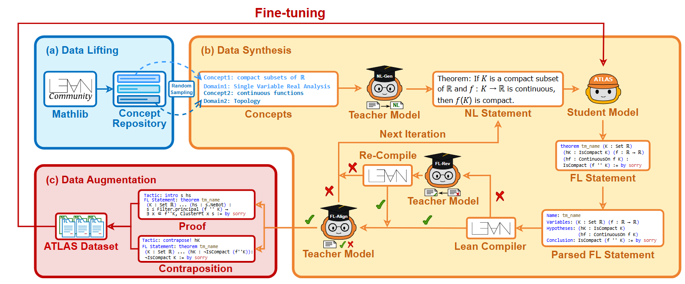

# 📝 [ATLAS: Autoformalizing Theorems through Lifting, Augmentation, and Synthesis of Data] Review

> **Paper**: [[Link](https://arxiv.org/abs/2502.05567)]
> 
> **Author**: Xiaoyang Liu, Kangjie Bao, Jiashuo Zhang, Yunqi Liu, Yu Chen, Yuntian Liu, Yang Jiao, Tao Luo
> 
> **Tags**: #ATLAS #Autoformalization #LLMs #Parallel_Corpora #Data_Lifting #Data_Synthesis #Data_Augmentation #Expert_Iteration
>
> **Reviewer**: Woojin Cho (WoojinCho-Ryan)
> 
> **Status**: ✅ Read 

## 1. ⚡ One-Line Summary
ATLAS proposes a novel data generation framework that constructs a high-quality parallel corpus of 117k theorem statements by "lifting" concepts directly from Mathlib and applying structure-aware augmentations (such as extracting intermediate proof states) to achieve state-of-the-art autoformalization performance.

## 2. ❓ Problem Definition
The primary bottleneck in autoformalization is the scarcity of high-quality parallel corpora mapping natural language (NL) mathematics to formal language (FL). Existing methods, primarily relying on back-translation, often suffer from limited diversity and fail to leverage the structural richness of formal libraries, resulting in models that struggle with generalization and complex logical mappings.

## 3. 💡 Key Methodology
- **Concept-Centric Data Lifting:** Instead of scraping raw code, the authors extract a "Concept Repository" directly from Mathlib, systematically identifying key definitions and theorem structures to serve as seeds for data generation.
- **Structure-Aware Augmentation:** The framework introduces two novel augmentation strategies that exploit the formal environment:
  - **Proof State Lifting:** Leveraging the Lean 4 Infoview, intermediate goals within a proof are extracted and converted into independent theorem statements, significantly enriching the dataset with granular logical steps.
  - **Logical Equivalences:** Applying transformations like contraposition to generate semantically equivalent but syntactically distinct variations.
- **Teacher-Student Synthesis Loop:** A "Teacher" model generates natural language descriptions for the formal statements, which are then filtered and refined through a distillation process involving the Lean compiler to ensure syntactic validity and alignment.

## 4. 📊 Key Results
- **SOTA Performance:** The ATLAS Translator (fine-tuned Llama-3.1-8B) achieved state-of-the-art results across major benchmarks (MiniF2F, ProofNet), showing statistically significant improvements ($p<0.05$) over previous best models like Herald and Kimina.
- **Efficiency of Data Quality:** The study demonstrated that a smaller model (8B) trained on ATLAS's high-quality, structure-augmented data could outperform larger or more complex baselines, validating the "quality over quantity" hypothesis in neuro-symbolic training.
- **OOD Generalization:** The "Lifting" strategy proved critical for Out-of-Distribution (OOD) performance, enabling the model to correctly formalize statements involving concepts that were not explicitly dominant in the training distribution.

## 5. 🧠 Critical Analysis & Insights

### 🌟 Significance (Contribution)
*Why does this paper matter?*
- **Paradigm Shift in Data Generation:** It shifts the methodology from simple "textual translation" to "structural extraction," demonstrating that exploiting the internal state of formal provers (e.g., Infoview states) yields far richer training signals than surface-level code scraping.
- **Scalable Pipeline for Parallel Corpora:** It provides a reproducible blueprint for generating massive, aligned (NL-FL) datasets without expensive human annotation, potentially solving the data bottleneck for Lean 4 and other newer formal systems.
- **Democratizing Autoformalization:** By showing that 8B-parameter models can achieve SOTA with the right data, it lowers the compute barrier for autoformalization research, moving away from the reliance on massive proprietary models.

### 🚧 Current Limitations
*What are the bottlenecks?*
- **Dependency on Formal Ontology:** The "Lifting" phase is strictly bound by the definitions available in the existing library (Mathlib). The framework cannot easily generate data for novel mathematical fields or non-standard definitions that have not yet been formalized.
- **Context Loss in Intermediate States:** While extracting intermediate proof states is innovative, these states often lack the surrounding context or prerequisites when treated as standalone theorems, potentially introducing "trivial" or "context-dependent" noise into the dataset.
- **Verifier Hallucination:** Although the Lean compiler checks for syntactic correctness, semantic alignment (whether the NL description truly matches the FL code) still relies on the Teacher model's capability, leaving room for subtle semantic mismatches that the compiler cannot catch.

### 🚀 Research Implications
*How can the community use this?*
- **Standard for Synthetic Data:** ATLAS establishes a new standard for synthetic data generation protocols. Future work on autoformalization will likely need to adopt similar "compiler-in-the-loop" and "state-extraction" techniques to remain competitive.
- **Integration with Neural Provers:** The dataset of "intermediate proof states" is highly valuable not just for autoformalization (translation), but also for training neural theorem provers (tactic prediction), as it breaks down complex proofs into granular, learnable sub-goals.
- **Cross-Lingual Adaptation:** The methodology is language-agnostic regarding the Natural Language side. The community can readily adapt the "Synthesis" module to generate parallel corpora for non-English languages (e.g., Chinese, Korean) by swapping the Teacher model prompts.
